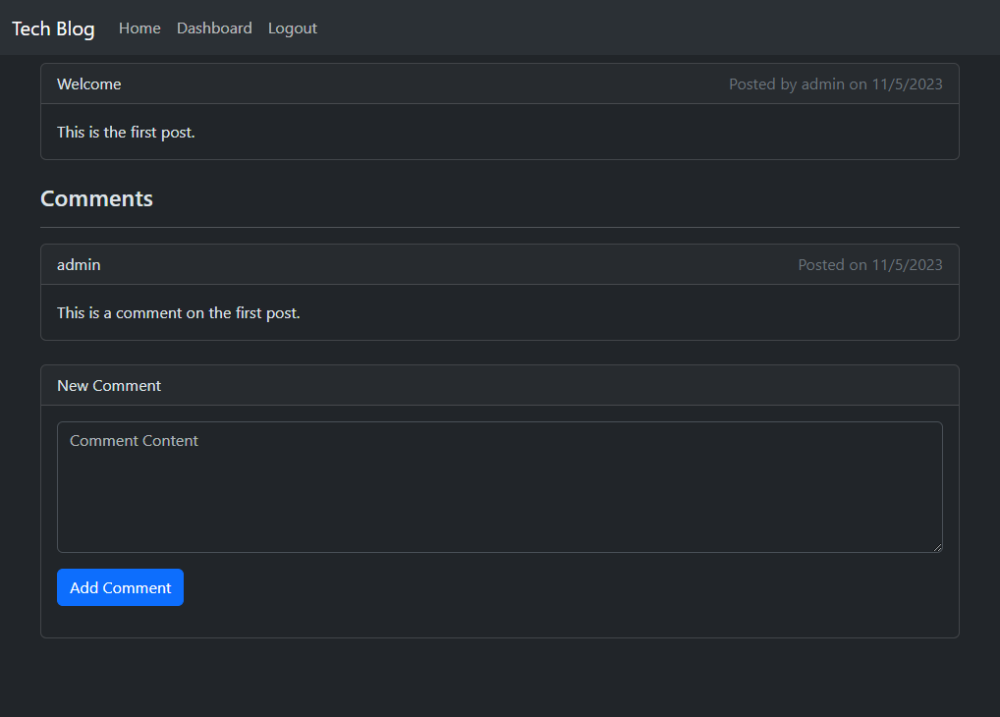

# Tech Blog


## Description

This project is a website that allows developers to publish their own blog posts and comment on posts made by others.

You may view a deployed version of this project [here](https://tech-blog.dev.133700.xyz/).



## Table of Contents

- [Description](#description)
- [Installation](#installation)
- [Usage](#usage)
- [How to Contribute](#how-to-contribute)
- [Tests](#tests)
- [Questions](#questions)
- [License](#license)

## Installation

To install Tech Blog, you must first clone the repository.

```bash
git clone https://github.com/ashoener/tech-blog.git
cd tech-blog
```

Afterwards, run the following command:

```bash
npm install
```

Once everything is installed, you need to specify what database to connect to. Rename the `.env.example` file to `.env`, and fill in the connection information. Remove the `SESSION_SECRET` line if you wish to generate a random secret every time the application is started.

## Usage

Once everything is connected, you may run `npm run start` to start up the server.

## How to Contribute

If you would like to contribute, create a pull request. Be sure to include information about what your changes do.

## Tests

Currently, there are no tests included with this project. They may be created in the future.

## Questions

If you have any questions, you may contact me via [GitHub](ashoener) or by [email](mailto:a.b.shoener@gmail.com).

## License

This project is covered under the MIT license. You may view it [here](/LICENSE).
